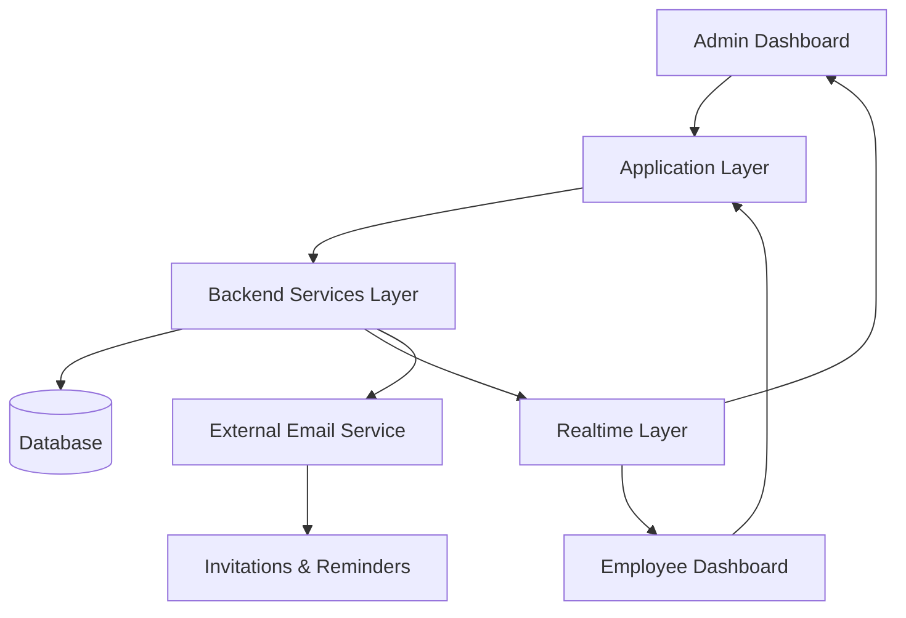

# Briefly — Multi-Tenant Team Briefing & Accountability System

---

## 1. Positioning Statement

A multi-tenant workspace-based briefing system that replaces fragmented team standups with structured daily reporting and real-time progress visibility.

This is a production-style SaaS workflow system — not an AI platform, enterprise suite, or complex distributed infrastructure.

---

## 2. Problem Statement

Distributed teams often rely on informal standups, chat messages, or scattered updates that make it difficult to track daily progress, blockers, and task completion in a structured way. This creates fragmented communication, poor visibility for managers, and inconsistent reporting from employees.

The objective was to replace these informal practices with a structured, workspace-based briefing system that enforces daily reporting discipline and provides real-time visibility into team progress.

---

## 3. Objective

Build a multi-tenant workspace system that:

- Enables organizations to create isolated workspaces for different teams
- Allows admins to configure and assign daily briefing questions
- Provides employees with structured time-bound submission workflows
- Delivers real-time completion visibility to admins through centralized dashboards
- Supports flexible team structures with multi-workspace membership and role-based access

---

## 4. System Overview

Briefly is a multi-tenant SaaS-style workspace system. Organizations create isolated workspaces where admins define daily briefing questions and invite members through a structured onboarding flow. Employees submit structured daily reports within their assigned workspaces before a configured deadline, and submissions are instantly reflected in the admin dashboard through a backend-as-a-service infrastructure handling authentication, database, and realtime subscriptions.

The system supports multiple admins per workspace and allows users to belong to multiple workspaces, enabling flexible organizational structures without manual follow-ups.

---

## 5. System Architecture

The system follows a layered architecture:

### Input Layer
- Admin-configured workspace setup and invitation events
- Employee daily briefing submissions
- Workspace membership and role assignments

### Processing Layer
- Briefing question configuration engine
- Time-bound submission workflow with deadline enforcement
- Role-based access control logic
- Workspace isolation and membership management
- Completion status calculation

### Output Layer
- Admin dashboard with real-time completion tracking
- Employee workspace view with pending and completed briefings
- Submission status indicators and completion percentages

---

## 6. Core Features

- Multi-tenant workspace system with isolated team environments
- Role-based access control (admin / employee)
- Daily structured briefing configuration
- Time-bound submission workflow with deadline enforcement
- Real-time dashboard updates for submission status
- Email-based invitation and onboarding system
- Multi-workspace user membership
- Dynamic completion percentage tracking

---

## 7. Key System Flows

### A. Workspace & Invitation Flow
1. Admin creates a workspace
2. Admin invites employees via email
3. Employee accepts invitation and joins workspace
4. Membership stored in role-based structure

### B. Daily Brief Submission Flow
1. Admin configures daily briefing questions
2. Employees access their workspace dashboard
3. Employees submit structured responses before deadline
4. Submission stored and linked to user + workspace + date

### C. Deadline & Status Tracking Flow
1. Each workspace has a daily cutoff time
2. System tracks submitted vs pending users
3. Dashboard updates completion percentage dynamically

### D. Real-Time Update Flow
1. Employee submits a briefing
2. Admin dashboard updates instantly
3. Submission status changes in real time
4. Pending list refreshes automatically

### E. Reminder & Escalation Flow
1. System tracks approaching deadlines
2. Automated reminders sent to employees with pending submissions
3. Escalation notifications triggered for overdue submissions
4. Admin receives summary of non-compliant team members

---

## 8. Outputs / Proof

- Admin dashboard showing real-time completion status across team members
- Submission tracking with timestamps and user attribution
- Workspace-level completion metrics (submitted vs pending counts)
- Email-based invitation and onboarding trails
- Time-bound submission enforcement with visible deadline indicators

---

## 9. Engineering Highlights

- Multi-tenant architecture supporting isolated workspaces with shared infrastructure
- Workflow-driven submission engine with deadline tracking and status calculation
- Real-time synchronization layer for live dashboard updates across admin and employee views
- Role-based access model enabling flexible team hierarchies and delegation
- Event-driven notification system for invitations and submission events
- Production-style implementation using backend-as-a-service infrastructure for authentication, database, and realtime subscriptions

---

## 10. Real-World Use Cases

- Daily standup replacement for distributed engineering teams
- Project status tracking for client-facing delivery teams
- Manager visibility into team blockers and priorities
- Structured check-in systems for remote-first organizations
- Accountability tracking for asynchronous team workflows

---

## 11. Impact / Results

- Replaced fragmented standups and scattered updates with structured, auditable reporting
- Eliminated manual follow-ups through automated deadline enforcement
- Provided managers with instant visibility into daily team completion status
- Supported flexible team structures through multi-workspace membership
- Improved daily reporting discipline across distributed team environments

---

## 12. Future Improvements

- Analytics module for tracking submission patterns and engagement trends over time
- Custom briefing templates and question libraries per workspace
- Export and reporting features for historical review
- Team-level and organization-level aggregation views

---

## 13. Final Summary

Briefly is a production-style SaaS workflow system that improves team accountability by replacing fragmented daily communication with structured, time-bound reporting and real-time admin visibility. It demonstrates practical implementation of multi-tenancy, role-based access control, workspace isolation, and real-time collaboration in a lightweight, focused product system.
