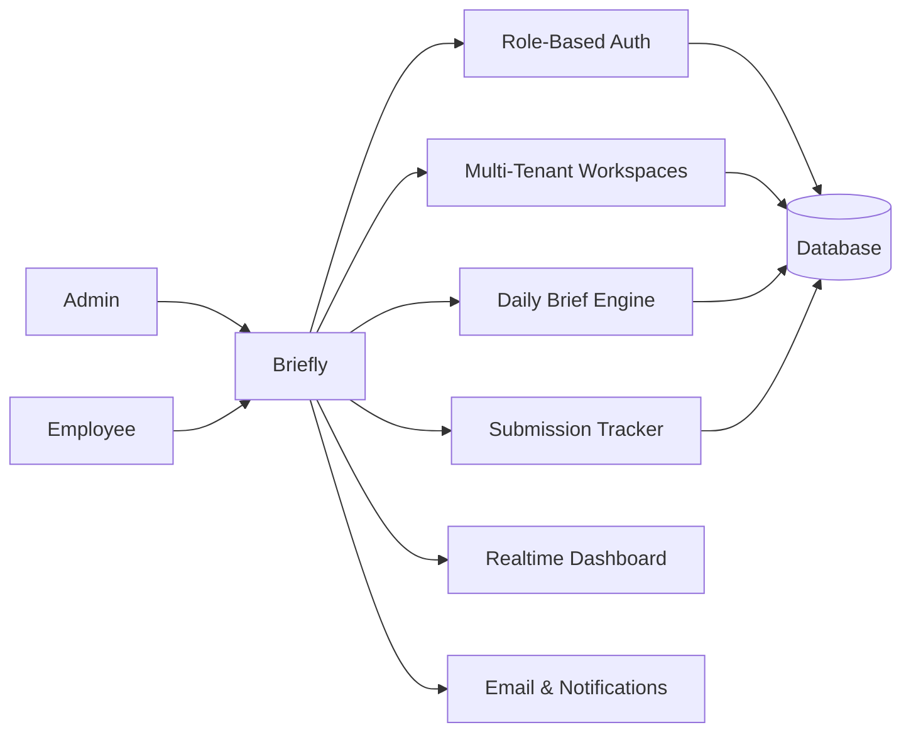

# Briefly — Multi-Tenant Team Briefing & Accountability System

## Overview

Briefly is a multi-tenant SaaS-style workspace system designed to structure daily team communication and improve accountability across distributed teams. It replaces informal standups and fragmented updates with a structured briefing workflow where admins define daily questions and employees submit time-bound progress reports within their assigned workspaces.

The system supports multiple admins per workspace, multi-workspace membership per user, and real-time visibility into submission progress, enabling teams to coordinate work without manual follow-ups.

## Problem Statement

Distributed teams often rely on unstructured communication methods such as chats or manual standups, which leads to:

- **Inconsistent progress reporting**
- **Lack of visibility into team status**
- **Delayed identification of blockers**
- **Fragmented communication across multiple tools**

Briefly solves this by centralizing daily reporting into a structured, time-bound system.

## Core System Capabilities

- Multi-tenant workspace architecture
- Role-based access (Admin / Employee)
- Invitation-based onboarding via email
- Daily briefing question configuration
- Time-bound submission system
- Real-time dashboard updates
- Automated notifications and reminders
- Workspace switching for multi-team users

## System Architecture

### Architecture Diagram

### Core System Flows

#### 1. Invitation Flow
Admin invites employee → Email sent → Employee accepts → Membership created → Workspace access granted

#### 2. Daily Brief Flow
Employee opens dashboard → answers structured questions → submits before deadline → stored in backend → realtime update triggers admin dashboard refresh

#### 3. Monitoring Flow
Admin views dashboard → sees submission progress → identifies pending users → sends reminders if needed

#### 4. Deadline Enforcement Flow
System tracks daily cutoff time → marks pending submissions → updates UI status dynamically

### Data Model (High-Level)

- **Users** → authentication identity
- **Workspaces** → team containers
- **Memberships** → user ↔ workspace (role-based)
- **Invites** → pending onboarding records
- **Briefs** → daily question templates
- **Submissions** → employee responses

## Key Features

- Multi-workspace user support
- Role-based admin/employee system
- Daily structured briefing system
- Real-time submission tracking
- Email-based onboarding and notifications
- Deadline-based workflow enforcement
- Team progress visibility dashboard

## Outcome / Impact

- Standardized daily team reporting process
- Improved visibility into team progress
- Reduced dependency on manual follow-ups
- Centralized communication across distributed teams
- Lightweight SaaS-style workflow system for teams

## Live Demo

**https://my.brieflyapp.co**

## Final Notes

Briefly demonstrates the ability to design and implement a multi-tenant SaaS workflow system with real-time coordination, role-based access control, and event-driven notifications — simulating production-grade team management infrastructure.