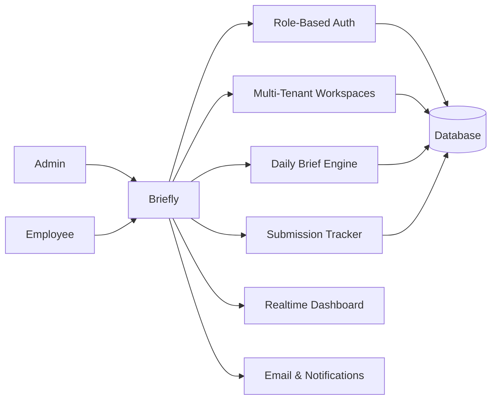

# Briefly — Multi-Tenant Team Briefing & Accountability System

## Overview

Briefly is a multi-tenant SaaS-style workspace system designed to structure daily team communication and improve accountability across distributed teams. It replaces informal standups and fragmented updates with a structured briefing workflow where admins define daily questions and employees submit time-bound progress reports within their assigned workspaces. The system supports multiple admins per workspace, multi-workspace membership per user, and real-time visibility into submission progress.

## System Problem

Distributed teams rely on unstructured communication methods such as chats or manual standups, which leads to inconsistent progress reporting, lack of visibility into team status, delayed identification of blockers, and fragmented communication across multiple tools.

Briefly solves this by centralizing daily reporting into a structured, time-bound system.

## System Architecture

The system operates as a multi-tenant workspace engine with role-based access, daily brief scheduling, and real-time submission tracking.

## State Model

### Brief Lifecycle

Brief Created → Published → Active Submission Window → Closed → Archived

### Submission States

Not Started → In Progress → Submitted → Overdue (missed deadline)

### Workspace Membership

User invited → Membership created → Active in workspace → Can be removed

## System Flow

### Invitation Flow

Admin invites employee → Email sent → Employee accepts → Membership created → Workspace access granted

### Daily Brief Flow

Employee opens dashboard → Answers structured questions → Submits before deadline → Stored in backend → Realtime update triggers admin dashboard refresh

### Monitoring Flow

Admin views dashboard → Sees submission progress → Identifies pending users → Sends reminders if needed

### Deadline Enforcement

System tracks daily cutoff time → Marks pending submissions → Updates UI status dynamically

## Core Components

### Multi-Tenant Workspace Engine

Each workspace operates as an isolated tenant with its own admins, briefs, and members. Users can belong to multiple workspaces with different roles in each.

### Daily Brief Engine

Admins configure structured daily questions per workspace. The brief engine manages publication scheduling, active submission windows, and deadline enforcement.

### Submission Tracker

Tracks submission status per user per brief: not started, in progress, submitted, or overdue. Status changes trigger realtime UI updates across all workspace members.

### Realtime Dashboard

Provides admins with live submission progress visibility. The dashboard updates without manual refresh as employees submit briefs.

### Email & Notifications

Automated invitation emails, daily reminder notifications, and deadline warnings are delivered through an email and notification subsystem.

## Engineering Decisions

Multi-tenancy was chosen over single-workspace to support team-level isolation within a single deployment. Realtime updates replace polling to minimize latency between submission and dashboard visibility. Deadline enforcement is server-side to prevent client-side manipulation of submission windows.

## Outcome

The system standardizes daily team reporting, improves visibility into team progress, reduces dependency on manual follow-ups, and centralizes communication across distributed teams. It demonstrates a lightweight SaaS-style workflow system suitable for team management at scale.

## Technologies

- React
- TypeScript
- Supabase (Authentication & Database Storage & Realtime)

## Links

- Live Demo: https://my.brieflyapp.co
