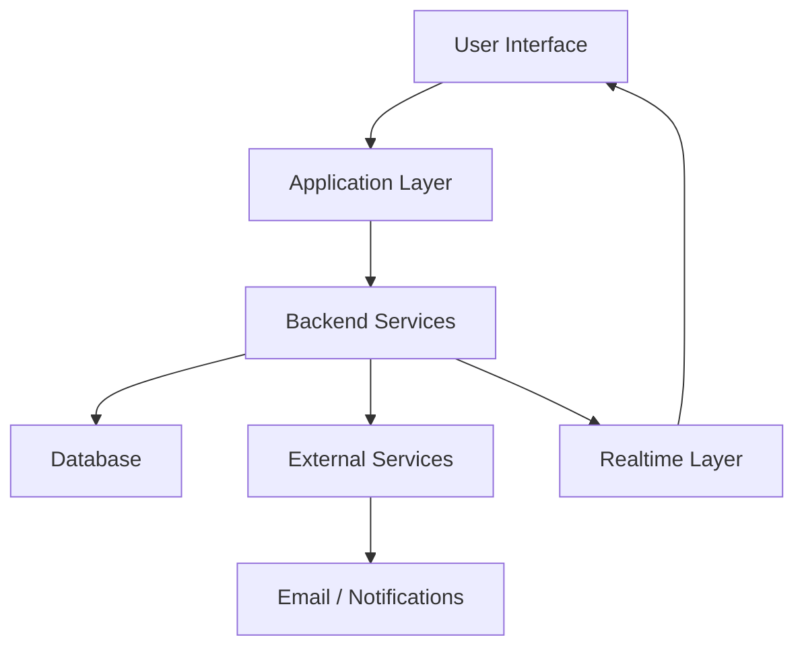

# 🧠 Universal Case Study Writing System (Portfolio Standard)

---

## 🟥 1. Core Principle (What a Case Study Is)

A case study is NOT documentation or a tutorial.

It is a **structured system narrative** that demonstrates:
> how you design, build, and reason about real-world systems that solve a problem.

---

## 🟦 2. System Thinking Rule (Highest Priority)

Every project must be framed as a **system**, not a feature or toolset.

A system always includes:

- Inputs
- Processing
- Decision logic (if applicable)
- Outputs

❌ Wrong:
- “I built a dashboard”
- “I used Supabase and React”

✔ Correct:
- “A multi-tenant workflow system for structured team reporting”

---

## 🟨 3. System > Tools Rule

Tools are implementation details, not the identity.

❌ Wrong:
- “Built using Jenkins, Docker, and SonarQube”

✔ Correct:
- “A CI/CD automation system with integrated testing and security layers”

---

## 🟩 4. Outcome > Implementation Rule

Focus on what the system achieves.

❌ Wrong:
- “I implemented APIs for submission handling”

✔ Correct:
- “The system enables structured, time-bound reporting with real-time visibility”

---

## 🟦 5. Standard Case Study Structure (Mandatory)

All case studies MUST follow this structure:

1. Positioning Statement  
2. Problem Statement  
3. Objective  
4. System Overview  
5. System Architecture  
6. Core Features  
7. Key System Flows  
8. Outputs / Proof  
9. Engineering Highlights  
10. Real-World Use Cases  
11. Impact / Results  
12. Future Improvements  
13. Final Summary  

---

## 🟨 6. System Architecture Visualization Rule (MERMAID)

Every case study SHOULD include a **high-level architecture diagram** when the system has multiple components, workflows, or external integrations.

### ✔ Purpose of the Diagram:
- Show system structure at a glance
- Visualize data flow between components
- Clarify multi-service or multi-layer systems
- Improve client and reviewer understanding

---

### 🟦 Mermaid Diagram Standards

- Use **Mermaid syntax** for all architecture diagrams
- Keep diagrams **high-level and readable**
- Focus on **system components and flows**, not internal code logic
- Place diagram ONLY in **System Architecture section**

---

### ❌ Wrong (Over-detailed)
- microservices internal methods
- database schema details
- function-level flow

---

### ❌ Wrong (Too shallow)
- only “frontend → backend” with no structure

---

### ✔ Correct Level (Expected Standard)

- frontend / backend / database
- external services (email, storage, APIs)
- real-time or event-driven flows
- core system interactions

---

### 🟩 Example Format

## 🟨 7. Clarity & Readability Rule

Case studies must be:
- Easy to scan
- Structured with headings + bullets
- Understandable in 2–3 minutes

❌ Avoid:
- long paragraphs
- deep unnecessary explanations
- code-level detail

---

## 🟥 8. Proof-Based Rule

Every claim must connect to evidence:

- UI screenshots
- system outputs
- dashboards
- reports
- logs (only if necessary)

No unsupported claims.

---

## 🟦 9. Layered Architecture Rule

Always represent systems in layers:

- Input Layer (users, events, data entry)
- Processing Layer (business logic, workflows)
- Decision Layer (rules, validations, conditions)
- Output Layer (UI, reports, notifications)

This can be simplified depending on project complexity.

---

## 🟩 10. Reusability Rule

Each case study must work across:

- CV
- Upwork proposals
- Portfolio website
- GitHub README
- LinkedIn posts

So avoid platform-specific writing.

---

## 🟨 11. Positioning Rule (Very Important)

Always define:

### ✔ What the system IS
- SaaS workflow system
- automation system
- product system
- data processing system

### ❌ What it is NOT
- avoids overclaiming (AI system, security tool, etc.)

---

## 🟥 12. Over-Engineering Control Rule

Avoid unnecessary complexity:

❌ Do NOT include:
- logs and terminal dumps
- excessive screenshots
- low-level code explanation
- internal debugging flow

✔ Only include:
- system behavior
- architecture logic
- outputs that prove value

---

## 🟦 13. Business Context Rule

Every case study must answer:

> “Where does this exist in the real world?”

Examples:
- SaaS workflows
- DevOps pipelines
- team coordination tools
- automation systems
- data-driven applications

---

## 🟩 14. Consistency Rule (Portfolio-Level)

All projects must follow:
- same structure
- same tone
- same abstraction level
- same system-thinking approach

This creates **senior-level portfolio coherence**.

---

## 🟨 15. Depth Scaling Rule (Important)

Not all projects require equal depth:

- 🟩 Product apps → light architecture
- 🟦 SaaS systems → medium architecture
- 🟥 infrastructure systems → deep architecture

Adjust depth, not structure.

---

## 🟥 Final Principle

A case study is successful when:

✔ It is easy to understand  
✔ It shows system thinking  
✔ It proves real-world value  
✔ It is structured and consistent  
✔ It communicates engineering maturity without overcomplexity  

---