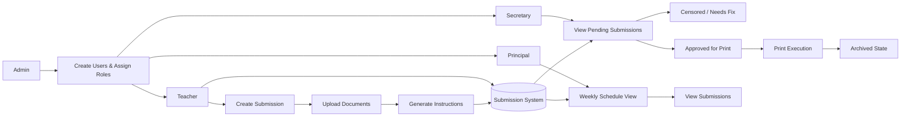

# CopyFlow — School Submission & Print Workflow Management System

## Overview

CopyFlow is a role-based school workflow system designed to manage academic submissions, reviews, and printing in a structured and controlled lifecycle. It replaces manual submission handling with a state-driven document workflow engine where teachers submit academic work, secretaries process and approve it, and principals monitor daily academic activity. The system ensures strict transitions between submission stages, enabling controlled document governance across the school.

## System Problem

Schools handling academic submissions face manual and inconsistent submission handling processes, no structured review and approval system, lack of centralized tracking of submission status, inefficient coordination between teachers, secretaries, and principals, risk of misplaced or untracked printed documents, and no formal lifecycle for submission progression. Existing systems rely heavily on manual communication, making workflow control unreliable.

## System Architecture

The system operates as a role-based document lifecycle engine with four actor types: Admin, Teacher, Secretary, and Principal. State transitions are controlled by role permissions rather than open access.

### Architecture Diagram

## State Model

### Submission States

Pending → Approved (print) or Censored (needs revision) → Printed → Archived

### Role States

- **Admin** — creates users and assigns roles
- **Teacher** — creates and submits academic work
- **Secretary** — reviews and transitions submission states
- **Principal** — monitors weekly schedule and submission details (read-only)

## System Flow

### Teacher Submission Flow

Create Submission → Fill Form → Upload Documents → Generate Instructions → Submit → Status = Pending

### Secretary Processing Flow

Pending Submission → Review → Either: Move to Censored (needs revision) OR Move to Printed → Automatically Archived

### Principal Monitoring Flow

View Weekly Calendar → Select Day → View Lessons → Open Submission Details

### Print Lifecycle

Submission Approved → Printed State → Auto Archive → Stored Record

## Core Components

### Submission State Machine

The submission lifecycle enforces strict state transitions: Pending, Approved for Print, Censored (revision required), Printed, and Archived. State transitions are controlled by role permissions rather than open access.

### Auto-Generated Instructions

Print instruction documents are generated automatically from submission metadata, eliminating manual document preparation.

### Print Queue Management

Censored submissions enter a print queue awaiting execution. Approved submissions proceed directly to print. Both paths terminate in the immutable Archive.

### Weekly Calendar View

Principals access a weekly calendar-based lesson visibility system. Daily lesson scheduling entries link to related submissions, creating traceability between schedule and document state.

### Immutable Archive

Completed printed submissions are stored in an archived state. Archived records are immutable, preserving academic record integrity.

## Engineering Decisions

The system was designed around role-based state enforcement rather than feature-based access control. This ensures that submission workflows cannot be circumvented through UI manipulation. State transitions are guaranteed by the system rather than requested by users.

## Outcome

The system standardizes submission processing across all school roles, replaces manual communication with controlled review and approval, automates state transitions for printed documents, and improves coordination between teachers, secretaries, and principals. Full visibility into academic document lifecycle is maintained through role-appropriate interfaces.

## Technologies

- React
- TypeScript
- Supabase (Authentication & Database storage)

## Links

- Live Demo: [https://copyflow-main.netlify.app](https://copyflow-main.netlify.app)
