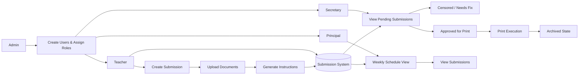

# CopyFlow — School Submission & Print Workflow Management System

## Overview

CopyFlow is a role-based school workflow system designed to manage academic submissions, reviews, and printing in a structured and controlled lifecycle.

It replaces manual submission handling with a state-driven document workflow engine where teachers submit academic work, secretaries process and approve it, and principals monitor daily academic activity.

The system ensures strict transitions between submission stages, enabling controlled document governance across the school.

## Problem Statement

Schools handling academic submissions face:

- Manual and inconsistent submission handling processes
- No structured review and approval system
- Lack of centralized tracking of submission status
- Inefficient coordination between teachers, secretaries, and principals
- Risk of misplaced or untracked printed documents
- No formal lifecycle for submission progression

Existing systems rely heavily on manual communication, making workflow control unreliable.

## Core System Capabilities

- Role-based workflow system (Admin, Teacher, Secretary, Principal)
- State-driven submission lifecycle with enforced transitions
- Auto-generated print instruction documents from submission metadata
- Conditional approval paths (direct print or censored review)
- Weekly calendar-based lesson visibility for principals
- Print queue management with automatic archival
- Single-school account model with manual user registration

## System Architecture

### Architecture Diagram

### Core System Flows

#### 1. Teacher Submission Flow
Create Submission → Fill Form → Upload Documents → Generate Instructions → Submit → Status = Pending

#### 2. Secretary Processing Flow
Pending Submission → Review → Either: Move to Censored (needs revision) OR Move to Printed → Automatically Archived

#### 3. Principal Monitoring Flow
View Weekly Calendar → Select Day → View Lessons → Open Submission Details

#### 4. Print Lifecycle Flow
Submission Approved → Printed State → Auto Archive → Stored Record

### Data Model (High-Level)

- **Users** → authentication identity with role context
- **Schools** → single-school containers
- **Employees** → school staff with assigned roles
- **Submissions** → lesson submissions with print metadata and state
- **Instructions** → auto-generated print instruction documents
- **Print Queue** → censored submissions awaiting print execution
- **Archive** → completed printed submissions (immutable)
- **Classes** → assigned class containers for scheduling
- **Calendar Events** → daily lesson scheduling entries

## Key Features

- Four-role permission system (Admin, Secretary, Principal, Teacher)
- Direct account creation by administrator without email invites
- Submission state machine with Pending, Censored, Print, and Archived states
- Secretary-controlled workflow transitions with branching approval paths
- Auto-generated instruction documents from submission forms
- Weekly calendar view with daily lesson tracking for principals
- Clickable lesson cards linking to related submissions
- Print queue with automatic archival upon completion
- Immutable archive for finalized academic records

## Outcome / Impact

- Standardized submission processing across all school roles
- Controlled review and approval system replacing manual communication
- Automated state transitions for printed documents
- Improved coordination between teachers, secretaries, and principals
- Full visibility into academic document lifecycle

## Live Demo

**https://copyflow-main.netlify.app**

## Final Notes

CopyFlow demonstrates the ability to design and implement a role-based document lifecycle workflow system with state-driven execution, conditional approval paths, and automated archival — simulating production-grade academic administration infrastructure.
