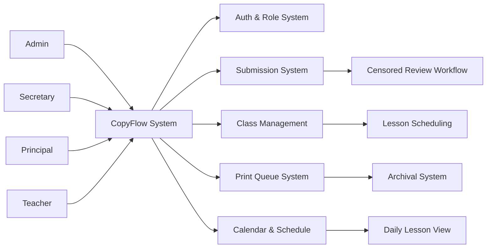

# CopyFlow — School Submission & Print Management System

## Role-Based School Administration and Lesson Submission Management System

CopyFlow is a role-based school administration platform that digitizes lesson submission workflows, print instruction management, and administrative review processes for single-school environments. It replaces disconnected paper-based and spreadsheet tracking with a centralized system where teachers submit lessons, principals review daily schedules, secretaries manage print queues, and administrators oversee operations. The platform automates document lifecycle management, auto-generates print instructions, and provides calendar-driven visibility into daily lesson activities across four distinct user roles.

## 🔗 Links
- Live Demo: https://copyflow-main.netlify.app

## Overview

CopyFlow is a structured school administration system that digitizes lesson submission workflows, print instruction management, and administrative review processes for single-school environments.

It replaces disconnected paper-based and spreadsheet workflows with a centralized, role-based platform where teachers submit lessons, principals review daily schedules, secretaries manage print queues, and administrators oversee school-wide operations.

## Problem Statement

School administration faces operational inefficiencies due to:

- Scattered lesson submission tracking across spreadsheets and physical documents
- Manual coordination between teachers, principals, and administrative staff
- Lack of structured print instruction management for lesson materials
- No centralized visibility into daily lesson schedules and submissions
- Inefficient review and archival workflows for printed materials
- Difficulty in assigning teachers to classes and scheduling lesson days
- Time-consuming manual document handling and filing

Existing tools handle either grading or scheduling, but fail to model a complete lesson submission-to-print workflow with role-specific access.

## Core System Capabilities

- Role-based access control with four distinct administrative roles
- Lesson submission lifecycle management with structured print workflows
- Calendar-based daily lesson visibility with weekly toggle navigation
- Print queue management with review and archival states
- Auto-generated print instruction documents from submission metadata
- Class and lesson day assignment with teacher registration
- Real-time status tracking across submission, censored review, and archival stages
- Centralized employee account management by school administrator

## System Architecture

### Architecture Diagram

### Core System Flows

#### 1. Teacher Workflow Flow
Login → View Assigned Classes → Create/Update Submission → Select Print Details → Upload Supporting Documents → Auto-Generate Instructions Document → Submit for Review

#### 2. Secretary Workflow Flow
Login → View Submission Queue → Review Submissions → Move to Censored → Review Censored Submissions → Mark for Print → Submission Auto-Archived

#### 3. Principal Workflow Flow
Login → View Daily Lesson Sheet → Toggle Calendar Week → Click Lesson Card → View Submission Details → Monitor Teacher Activity

#### 4. Admin Workflow Flow
Create School Account → Register Employees (Teacher/Principal/Secretary) → Manage Class Assignments → Allot Lesson Days → Oversee System-Wide Operations

#### 5. Submission Lifecycle Flow
Submission Created → Under Review → Moved to Censored → Approved for Print → Printed → Auto-Archived

### Data Model (High-Level)

- **Users** → authentication identity with role context
- **Schools** → institutional containers
- **Employees** → school staff with assigned roles
- **Classes** → assigned class containers
- **Lessons** → scheduled lesson plans with day assignments
- **Submissions** → teacher lesson submissions with print metadata
- **Print Instructions** → auto-generated documents from submission data
- **Documents** → uploaded supporting files
- **Calendar Events** → daily lesson scheduling
- **Print Queue** → censored submissions awaiting printing
- **Archive** → completed printed submissions

## Key Features

- Four-role permission system (Admin, Secretary, Principal, Teacher)
- Direct account creation by administrator without email invites
- Daily lesson sheet with weekly calendar navigation
- Lesson card detail views for principal oversight
- Class registration and teacher assignment by admin and secretary
- Lesson day allotment with teacher-class mapping
- Submission creation with customizable print detail selection
- Auto-generated instruction documents from submission forms
- Multi-document upload support for lessons
- Censored review workflow for secretary approval
- Automatic archival upon print status completion
- Real-time print queue management
- Activity tracking and status visibility across all roles

## Outcome / Impact

This system demonstrates a role-based school administration model where lesson submissions flow through structured review stages, print instructions are auto-generated from submission data, and daily operations are visible through calendar-driven interfaces.

It strengthens portfolio positioning as an enterprise administrative workflow system with multi-role access control, document lifecycle management, and state-driven submission processing.

## Live Demo

https://copyflow-main.netlify.app

## Final Notes

CopyFlow complements Virtual Office by demonstrating structured administrative workflow systems with rigid role hierarchies, document lifecycle automation, and state-driven review processes.

Together, they demonstrate SaaS workflow systems, role-based access architecture, and enterprise document management patterns.
