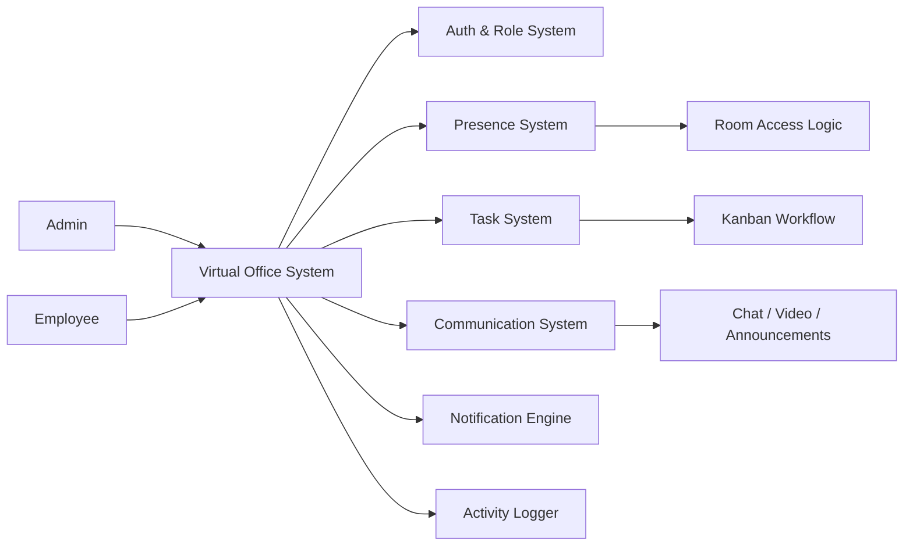

# Virtual Office — Real-Time Workspace Management System

## Overview

Virtual Office is a real-time workspace management system that simulates an internal office environment where teams collaborate through structured presence, task execution, and communication flows. It extends traditional task systems by introducing a live workplace layer, where employee availability, room access, and interaction states directly influence collaboration.

## System Problem

Remote teams face fragmentation in daily operations due to no real-time visibility of employee availability or focus state, disconnected tools for chat, tasks, and meetings, lack of structured workplace presence signals, poor context around who is working, available, or engaged, and inefficient coordination between managers and employees. Existing tools manage tasks and communication separately, but fail to model a real working environment flow.

## System Architecture

The system operates as a real-time workflow engine with role-based access and presence-driven interaction rules.

## State Model

### Employee Presence States

- At Desk — actively working, available for interaction
- Focus Time — working, limited interruptions
- On Break — temporarily unavailable
- Offline — not present in workspace

### Task Lifecycle

Task Assigned → In Progress → Review → Completed

### Room Interaction States

Access Request → Check Presence State → Enter Room (if available) or Knock Event → Employee responds

## System Flow

### Employee Workflow

Login → Join Workspace → Set Presence State → Access Room → View Tasks → Update Task Status → Join Meetings → Activity Logged

### Admin Workflow

Create Workspace → Invite Employees → Assign Tasks → Monitor Desk Panel → Enter Rooms → Broadcast Announcements → Track Activity

### Room Interaction

Access Request → Check Employee Presence State → If available → Enter Room / If unavailable → Trigger Knock Event → Employee receives notification → responds accordingly

### Task Lifecycle

Task Assigned → Visible in Employee Panel → Progress Updated → Moved via Kanban → Marked Complete → Attachments Uploaded → Logged in Activity System

## Core Components

### Presence Engine

Real-time presence tracking with status-based interaction rules. Employee availability state directly governs room access eligibility, notification delivery, and collaboration permissions.

### Virtual Room System

Room-based interaction model with enter/knock mechanics. Room access is gated by employee presence state rather than simple permission checks, creating an office-like interaction model.

### Task Execution System

Kanban workflow with assignment, status tracking, and progression. Tasks are embedded into the live operational flow with state-driven visibility and updates.

### Communication Layer

Real-time chat, video calling, and announcement broadcasting within room contexts. Communication is context-aware and state-driven rather than open-channel.

### Admin Desk Panel

Room visibility, access controls, employee monitoring, and announcement broadcasting from a unified admin interface.

### Notification Engine

Real-time notifications triggered by presence changes, task assignments, room access requests, and system events.

### Activity Logger

System event tracking for audit, analytics, and operational visibility.

## Engineering Decisions

The system was designed around presence-driven workflow architecture. Employee presence state is not metadata — it is a first-class system input that governs all interaction rules. The real-time layer was chosen over polling to maintain sub-second presence fidelity. Room access logic was designed to mimic physical office interaction patterns rather than traditional permission-based access.

## Outcome

The system delivers a real-time collaborative workspace model where employee presence directly affects system interactions, tasks are embedded into live operational flow, communication is context-aware and state-driven, and workspace behavior mimics a real office environment. It demonstrates presence-driven workflow architecture suitable for distributed team operations.

## Technologies

- React
- TypeScript
- Supabase (Authentication & Database & Realtime & Storage)

## Links

- Live Demo: [https://virtual-office-main.netlify.app](https://virtual-office-main.netlify.app)
