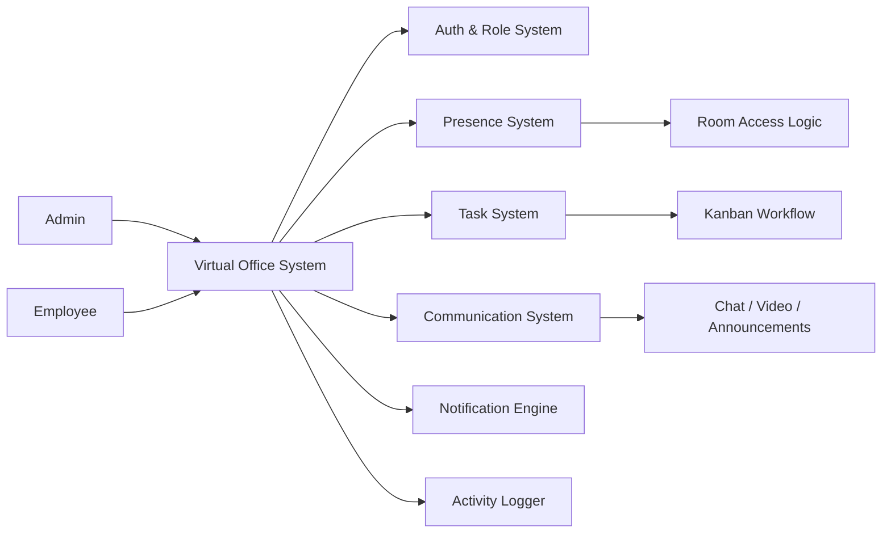

# Virtual Office — Real-Time Workspace Management System

## Overview

Virtual Office is a real-time workspace management system that simulates an internal office environment where teams collaborate through structured presence, task execution, and communication flows.

It extends traditional task systems by introducing a live workplace layer, where employee availability, room access, and interaction states directly influence collaboration.

## Problem Statement

Remote teams face fragmentation in daily operations due to:

- No real-time visibility of employee availability or focus state
- Disconnected tools for chat, tasks, and meetings
- Lack of structured workplace presence signals
- Poor context around "who is working, available, or engaged"
- Inefficient coordination between managers and employees

Existing tools manage tasks and communication separately, but fail to model a real working environment flow.

## Core System Capabilities

- State-driven virtual workspace engine governed by real-time presence and role context
- Real-time presence tracking with status-based interaction rules
- Virtual room-based interaction model with access control
- Task lifecycle management with structured workflows
- Real-time communication layer with chat, video, and announcements

## System Architecture

### Architecture Diagram

### Core System Flows

#### 1. Employee Workflow Flow
Login → Join Workspace → Set Presence State → Access Room → View Tasks → Update Task Status → Join Meetings → Activity Logged

#### 2. Admin Workflow Flow
Create Workspace → Invite Employees → Assign Tasks → Monitor Desk Panel → Enter Rooms → Broadcast Announcements → Track Activity

#### 3. Room Interaction Flow
Access Request → Check Employee Presence State → If available → Enter Room / If unavailable → Trigger Knock Event → Employee receives notification → responds accordingly

#### 4. Task Lifecycle Flow
Task Assigned → Visible in Employee Panel → Progress Updated → Moved via Kanban → Marked Complete → Attachments Uploaded → Logged in Activity System

### Data Model (High-Level)

- **Users** → authentication identity
- **Workspaces** → team containers
- **Rooms** → virtual room environments
- **Presence States** → availability and focus status
- **Tasks** → assigned work with lifecycle states
- **Messages** → communication records
- **Activity Logs** → system event tracking

## Key Features

- Real-time presence engine (At Desk, Focus Time, On Break, Offline)
- Virtual room system with enter/knock interaction model
- Admin desk panel with room visibility and access controls
- Task execution system with assignment and status tracking
- Kanban workflow with drag-and-drop task progression
- Real-time chat and video calling rooms
- Announcement broadcasting system
- Activity logging and real-time notifications

## Outcome / Impact

This system demonstrates a real-time collaborative workspace model where employee presence directly affects system interactions, tasks are embedded into live operational flow, communication is context-aware and state-driven, and workspace behavior mimics a real office environment.

It strengthens portfolio positioning as a real-time SaaS collaboration system with presence-driven workflow architecture.

## Live Demo

https://virtual-office-main.netlify.app

